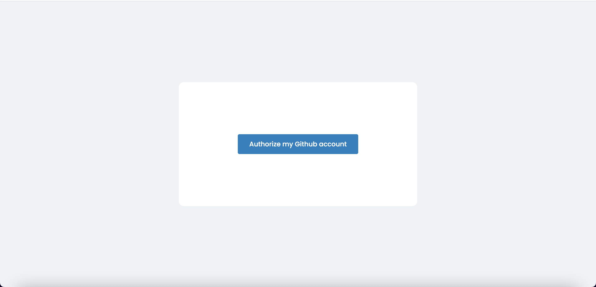
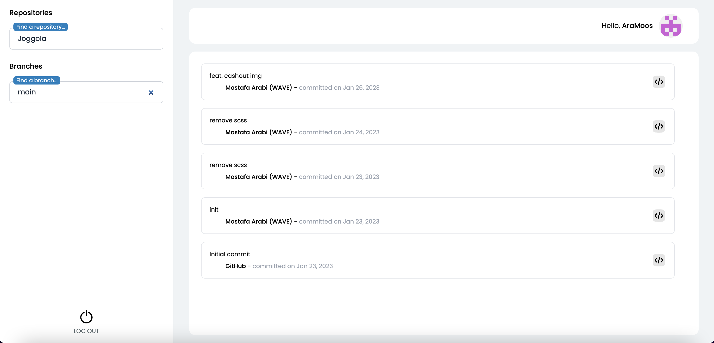

# mostafa_arabi-taas-frontend-challenge

this app allows you to list your repositories with ability to filter by name, with autocomplete. 
when you select repository the app load branches  the main branch is the selected by default then you can switch as you want to list commits by the selected repository and branch 

## Project Setup
To setup app clone repositry  in your machine open terminal then run  command below :

```sh
git clone git@github.com:AraMoos/mostafa_arabi-taas-frontend-challenge.git
```

then run :

```sh
cd mostafa_arabi-taas-frontend-challenge
```

### Installation

```sh
npm install
```

### Compile and Hot-Reload for Development

```sh
npm run dev
```

### Type-Check, Compile and Minify for Production

```sh
npm run build
```

### Run Unit Tests with [Vitest](https://vitest.dev/)

```sh
npm run test:unit
```

### Lint with [ESLint](https://eslint.org/)

```sh
npm run lint
```

## App pictures

#### Authorize page



#### Repositories page

